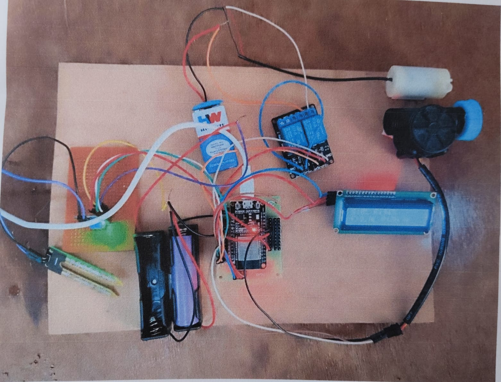
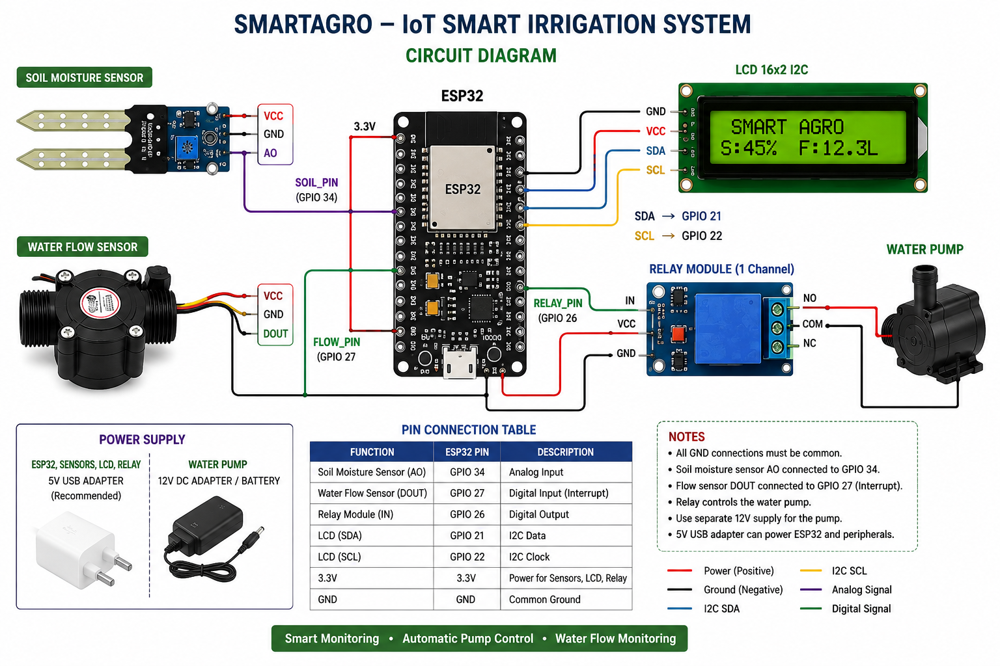

# 🌱 SmartAgro – IoT Smart Irrigation System

An IoT-based smart irrigation system using ESP32 to monitor soil moisture, automatically control a water pump, monitor water flow, and display real-time system status on a 16×2 I2C LCD.

## 📌 Project Overview

SmartAgro is designed to automate irrigation based on soil moisture conditions. The ESP32 reads the soil moisture sensor and controls the water pump through a relay.

The system also monitors water flow and displays the current system status on the LCD.

## ✨ Features

- 🌱 Soil moisture monitoring
- 💧 Automatic water pump control
- 🔄 Water flow monitoring
- 📟 Real-time LCD display
- ⚡ ESP32-based control system
- 🚨 No-water-flow alert
- 🔌 Relay-based pump switching

## 🛠️ Components Used

- ESP32
- Soil Moisture Sensor
- Water Flow Sensor
- 1-Channel Relay Module
- DC Water Pump
- 16×2 I2C LCD
- Power Supply
- Connecting Wires

## 🔌 Pin Connections

| Component | ESP32 Pin |
|---|---|
| Soil Moisture Sensor | GPIO 34 |
| Water Flow Sensor | GPIO 27 |
| Relay Module | GPIO 26 |
| LCD SDA | GPIO 21 |
| LCD SCL | GPIO 22 |

## ⚙️ Working Principle

1. The soil moisture sensor measures the moisture level of the soil.
2. The ESP32 processes the sensor reading.
3. When the soil becomes dry, the relay activates the water pump.
4. When the soil becomes sufficiently wet, the pump is turned OFF.
5. The water flow sensor monitors the water flowing through the system.
6. The LCD displays soil moisture, flow rate, and pump status.
7. If the pump is ON but no water flow is detected, the system generates an alert through the Serial Monitor.

## 📊 System Output

The LCD displays:

- Soil moisture percentage
- Water flow rate
- Pump ON/OFF status

## 📷 Project Images

### Project Board

### Circuit Diagram

## 💻 Source Code

The complete ESP32 Arduino code is available here:

[SmartAgro.ino](SmartAgro.ino)

## 📄 Project Documentation

The complete project report is available here:

[SmartAgro Project Report](FINAL_SMARTAGRO_PB2Doc%20(2).pdf)

## 🎯 Project Objective

The main objective of SmartAgro is to reduce unnecessary water usage by automating irrigation according to soil moisture conditions while providing real-time monitoring of the irrigation system.

## 🚀 Technologies Used

- ESP32
- Arduino IDE
- Embedded C/C++
- IoT
- Sensors
- I2C Communication

## 👨‍💻 Project

**SmartAgro – IoT Smart Irrigation System**
